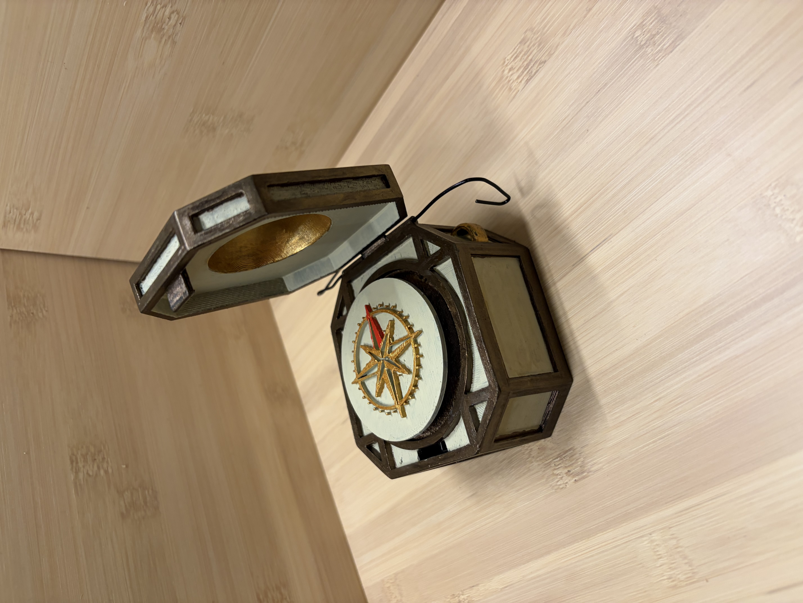
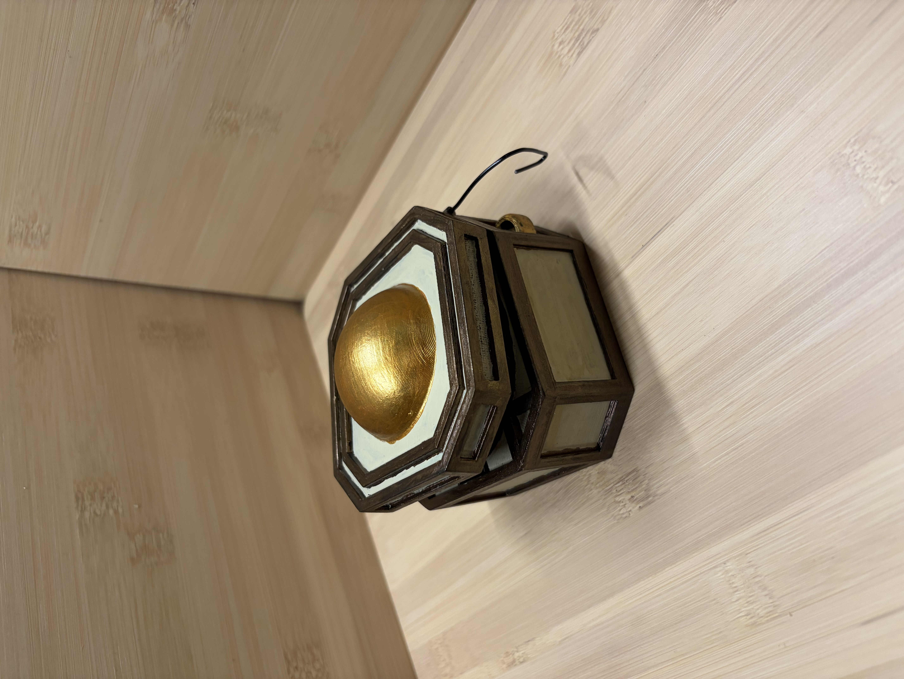

# The Lost Compass

A LARP and theatrical prop compass with a real magnetic sensor, physical servo-driven needle, and a wireless control interface. Built around a Seeed XIAO ESP32-C3, it runs its own WiFi access point — no internet connection required. The controller connects from any phone or tablet to switch modes and set bearings in real time. The player sees only the needle.

<a href="assets/Compass.jpeg">
  
</a>
<a href="assets/Compass_side.jpeg">
  
</a>
<a href="assets/Compass_closed.jpeg">
  
</a>

Full technical reference is in [`docs/Compass_tech_reference.html`](docs/Compass_tech_reference.html).

---

## Features

- **Four operational modes** — Free Needle (live magnetic heading), Fixed Bearing (locked to a set bearing), Lazy Spin (slow searching arcs), Erratic Spin (chaotic bursts)
- **Dead-reckoning needle tracking** — firmware maintains an estimated dial position using calibrated speed constants and elapsed time
- **Standalone WiFi AP** — no router, no internet; connect directly to the device
- **Vintage web interface** — 1834 nautical aesthetic; works on iOS Safari and Android
- **Hidden config page** — live heading offset adjustment, dead-reckoning bias correction, dial initialisation
- **Light sleep / wake** — lid-actuated button; needle position preserved in RAM across sleep cycles
- **Persistent settings** — heading offset and bias values stored in ESP32 NVS flash; survive power cycles

---

## Hardware

See [`hardware/BOM.md`](hardware/BOM.md) for the full component list and pin assignments.

The enclosure is a 3D printed design with a vintage nautical aesthetic.
<!-- Add link to Printables / Thingiverse / STL files when available -->

A wiring diagram (Fritzing / KiCad) is in [`hardware/`](hardware/) — see that folder for the schematic.

---

## Firmware

The firmware is Arduino IDE based, targeting the ESP32-C3.

### Prerequisites

Install the following in Arduino IDE before building:

| Library | Install via |
|---|---|
| `ESP32Servo` | Arduino Library Manager |
| `ESP32 Arduino core` | Board Manager — `https://raw.githubusercontent.com/espressif/arduino-esp32/gh-pages/package_esp32_index.json` |

The magnetometer is accessed via direct I2C register reads — no additional library required.

### Files

```
firmware/
├── lost_compass/
│   ├── lost_compass.ino   ← main sketch
│   ├── html_page.h        ← main web interface (PROGMEM)
│   └── config_page.h      ← calibration page (PROGMEM)
└── compass_cal/
    └── compass_cal.ino    ← standalone servo speed measurement sketch
```

> **Note for Arduino IDE:** HTML and JavaScript must live in the `.h` files, not inline in the `.ino` as PROGMEM raw string literals. The Arduino IDE preprocessor scans inside raw strings and misidentifies JavaScript `function` declarations as C++ prototypes, causing compile errors.

### Flashing

1. Open `firmware/lost_compass/lost_compass.ino` in Arduino IDE
2. Select board: **XIAO ESP32C3**
3. Select the correct port
4. Upload

### Connecting

1. Power on the compass
2. On your phone or laptop, join the WiFi network:
   - **SSID:** `CompassControl`
   - **Password:** `compass123`
3. Open `http://192.168.4.1` in a browser

> If the page won't load, disable mobile data — the network carries no internet signal and iOS/Android may prefer the cellular connection.

---

## Calibration

Full calibration procedure is in [`docs/calibration.md`](docs/calibration.md).

The short version for repeat use: power on, open the lid, rotate the physical needle to N by hand, press **Initialise Dial** at `http://192.168.4.1/config`.

---

## Known Issues

See [`docs/known-issues.md`](docs/known-issues.md) for documented hardware quirks and firmware gotchas.

---

## Repository Structure

```
lost-compass/
├── README.md
├── firmware/
│   ├── lost_compass/          ← flash this for normal use
│   │   ├── lost_compass.ino
│   │   ├── html_page.h
│   │   └── config_page.h
│   └── compass_cal/           ← one-time servo speed calibration
│       └── compass_cal.ino
├── hardware/
│   ├── BOM.md
│   └── schematic.*            ← Fritzing / KiCad files (add when ready)
├── print/
│   └── README.md              ← 3D print notes and links
└── docs/
    ├── calibration.md
    └── known-issues.md
```

---

## License

<!-- Choose a licence and add it here. MIT is common for open hardware/firmware projects. -->
